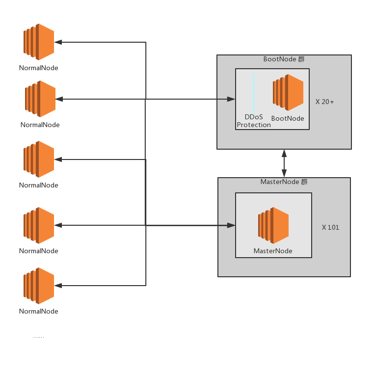

# VeChain core nodes security checklist（唯链核心节点安全执行指南）

> by 慢雾安全团队 & Joinsec Team

### [English](./README-en.md)

## 目录
* [安全方案简介](#安全方案简介)
* [架构核心目标](#架构核心目标)
* [面临的主要问题](#面临的主要问题)
* [架构核心设计](#架构核心设计)
* [核心防御](#核心防御)
* [推荐总架构](#推荐总架构)
	* [架构各部分设计说明](#架构各部分设计说明)
		* [1. BootNode](#1-bootnode)
		* [2. MasterNode](#2-masternode)
* [安全加固方案](#安全加固方案)
	* [1. HTTP API 安全](#1-http-api-安全)
		* [1.1 屏蔽 HTTP API](#11-屏蔽-http-api)
		* [1.2 HTTP API 防护](#12-http-api-防护)
	* [2. 配置安全](#2-配置安全)
		* [2.1 开启日志记录](#21-开启日志记录)
		* [2.2 设置最大连接数](#22-设置最大连接数)
		* [2.3 非 root 启动 thor](#23-非-root-启动-thor)
		* [2.4 监听随机端口](#24-监听随机端口)
	* [3. 网络安全](#3-网络安全)
		* [3.1 云服务商](#31-云服务商)
		* [3.2 DDoS 防御](#32-ddos-防御)
	* [4. 主机安全](#4-主机安全)
	* [5. 威胁情报](#5-威胁情报)
	* [6. NormalNode（普通节点）核心安全配置总结](#6-normalnode-普通节点核心安全配置总结)
* [致谢](#致谢)

## 安全方案简介
鉴于唯链（ VeChain ）去中心化的设计，对单一节点的依赖性不强。主设计核心偏向于保证整个网络中稳定维持着一定数量的安全主节点（ MasterNode ）。

## 架构核心目标

1. 保护普通节点 HTTP API 安全
2. 保护主节点 MasterNode 服务器正常通信与运行
3. 保护初期 BootNode 列表内节点的正常通信与安全
4. 增强初始主网整体抗攻击能力

## 面临的主要问题

1. 对 BootNode 及 MasterNode 进行针对性攻击，如 DDoS 等
2. HTTP API 功能被未授权访问及滥用
3. 通信故障

## 架构核心设计

1. 保证 BootNode 列表整体可用性高，并部署针对性防御
2. 对比 EOS 架构，适当降低单节点成本，增加整体数量，并保证 MasterNode 的稳定

## 核心防御

1. 默认关闭 HTTP API。必须打开时，混淆端口，并架设高防等保护
2. 增加 BootNode 整体数量，并保证遭遇 DDoS 后有很高的自恢复性
3. 暴露在公网的 MasterNode 架设抗 DDoS 防御保证整体网络稳定

## 推荐总架构

架构说明：

鉴于 VeChain 的特性，该架构设计核心是以整体网络的壮硕性为导向。

为了应对可能的 DDoS 攻击，核心节点（ BootNode 及 MasterNode ）应部署高防，在攻击到来后可保护 BootNode 能正常为新节点提供初始化服务。

并且

由于在启动初期节点较少，为整个网络配置大于 20 个 BootNode 节点，并对 BootNode 进行针对性的防御（如部署高防），防止 DDoS 流量聚焦攻击，20 个以上节点数量难以一次性被攻击瘫痪。

### 架构各部分设计说明

#### 1. BootNode

BootNode 是固定的网络初始化节点，用于节点发现，核心防御策略是增加节点数量，并将节点分散在不同网段。建议使用域名解析指向节点(而非固定 IP)，硬编码里预留 20+ 域名，节点只开启 P2P 端口，并布置 DDoS 防御策略。

#### 2. MasterNode

VeChain 网络中存在 101 个 MasterNode，官方推荐 MasterNode 部署到内网，此部分数量较大难以被攻击，但对于端口暴露在公网的 MasterNode，也需要架设抗 DDoS 防御。

## 安全加固方案

### 1. HTTP API 安全

#### 1.1 屏蔽 HTTP API

建议不要把 HTTP API 设置为对外网开放（启动时不做任何设置即为不向外网开放）

#### 1.2 HTTP API 防护

不建议把节点的 API 直接暴漏在公网中，如有暴露的需求请在 HTTP 之前添加保护措施

### 2. 配置安全

#### 2.1 开启日志记录

- 建议 BootNode 和 MasterNode 启动参数设置 `--verbosity 9` ，以记录完整日志

#### 2.2 设置最大连接数

- 启动参数 `--max-peers` 可以设置 P2P 端口并发连接数，默认连接数是 25，可以根据节点性能酌情配置，同时优化 `ulimit` 系统参数和内核参数，增强恶意连接攻击承受能力。

#### 2.3 非 root 启动 thor

建议编译完成后，创建普通用户账号，并使用该账号启动 `bin/thor`，避免使用 root ，降低风险。

#### 2.4 监听随机端口

- `--api-addr IP:PORT`
- `--p2p-port PORT`

每次启动时随机监听一个端口，如果是对外服务的，建议采用 [主机安全](#4-主机安全) 中的配置方法

### 3. 网络安全

#### 3.1 云服务商

经慢雾安全团队测试，Google Cloud、AWS 及 UCloud 等具有更好的抗 DDoS 攻击的性能，并且在 DDoS 攻击过后服务商不会临时封锁服务器，可以极为快速的恢复网络访问，推荐核心节点使用。（请谨慎选择云服务商，许多云服务商在遭遇 DDoS 等攻击时会直接关闭服务器）

#### 3.2 DDoS 防御

为应对可能发生的 DDoS 攻击，建议把节点部署在内网，如果暴露在公网的要加 DDoS 防御，建议核心节点提前配置 Cloudflare、AWS Shield 等 DDoS 高防服务。

### 4. 主机安全

- 防止全网扫描定位高防后的服务器，修改同步端口 11235 （同理 HTTP API 的 8669）至全网最大存活数量的端口 80、443 或 22，这样可以有效抬高攻击者定位成本。
- 关闭不相关的其他服务端口，并在 AWS 或 Google Cloud 上定制严格的安全规则。
- 更改 SSH 默认的 22 端口，配置 SSH 只允许用 key （并对 key 加密）登录，禁止密码登录，并限制访问 SSH 端口的 IP 只能为我方运维 IP。
- 在预算充足的情况下，推荐部署优秀的 HIDS（或者强烈建议参考开源的 OSSEC 相关做法），及时应对服务器被入侵。

### 5. 威胁情报

- 强烈建议做好相关重要日志的采集、储存与分析工作，这些日志包括：HTTP API 与 P2P 端口的完整通信日志、主机的系统日志、节点相关程序的运行日志等。储存与分析工作可以选择自建类似 ELK (ElasticSearch, Logstash, Kibana) 这样的开源方案，也可以购买优秀的商业平台。
- 如果使用了成熟的云服务商，他们的控制台有不少威胁情报相关模块可重点参考，以及时发现异常。
- 当节点出现重大漏洞或相关攻击情报，第一时间启动应急预案，包括灾备策略与升级策略。
- 社区情报互通有无。

### 6. NormalNode （普通节点）核心安全配置总结

1. 选用 Google Cloud、AWS 及 UCloud 等可靠的云服务商做节点基础设施，服务器配置在双核4G以上
2. 配置规则禁止与 node 服务不相关的其他服务端口开放（ SSH 只开启证书登陆并限制访问 SSH 端口的 IP 只能为我方运维 IP ）
3. 使用非 root 运行 node 程序，启动时配置 `--p2p-port PORT` 让 P2P 端口随机，并且若无必要则配置 HTTP API 只对本地监听

## 致谢

在此非常感谢

* VeChain Team

对节点安全测试的大力支持。